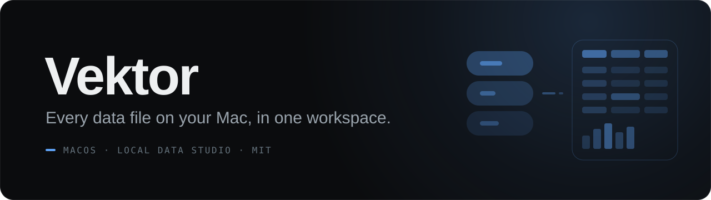
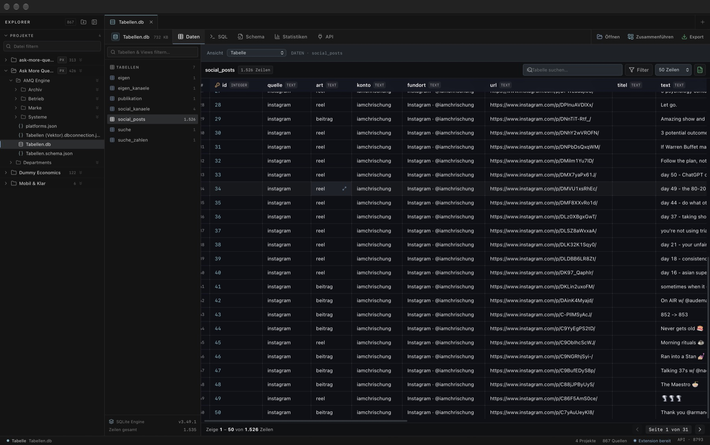
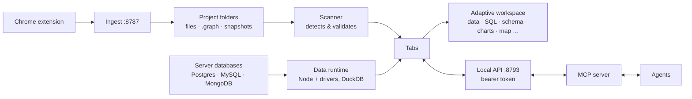

<p align="center"></p>

<p align="center">
  
  
  
  
  
  
</p>

<p align="center"><sub>🇩🇪 <a href="docs/HANDBUCH.md">Deutsches Handbuch</a></sub></p>

**Open any data file on your Mac as a tab, and get the right tools for it automatically.**

Vektor is a local macOS app for relational, tabular, graph and snapshot data. Register your project folders once; SQLite, CSV, Parquet, DuckDB, Postgres, `.graph` files or Redis snapshots all open in the same workspace, which adapts its views to the format it detects.

<p align="center"></p>

## Highlights

- **One workspace, many formats.** Every source opens as a real tab. The shared main area switches between data, SQL, schema, statistics, graph or document tools depending on what it finds.
- **Views on demand.** On tabular data, *View* adds record, table relations, charts, pivot, timeline, calendar, kanban, map, gallery, compare, data quality and vectors (cosine similarity).
- **Safe by default.** Tabular sources load into an in-memory working copy, server databases are imported read-only, and Redis snapshots open as protected temporary copies. AOF files are inspected, never executed.
- **`⌘P` across projects.** Fuzzy search over file name, project and relative path in all registered folders. `Enter` opens in the current tab, `⌘Enter` in a new one.
- **Merge files into one table.** Combine several CSV, TSV, JSON/JSONL and Excel files into a single working copy: schemas are unioned, missing values become `NULL`, duplicates can be dropped by the columns you pick.
- **Filters and foreign keys.** Stack parameter-bound conditions with `AND`; click a foreign-key value to open the referenced table, already filtered to that key.
- **No silent data loss.** Unsaved changes show as a dot on the tab, and `⌘W` asks before discarding. `⌘S` opens the export or saves the graph.
- **Built for agents too.** A token-protected local API (`/api/v1/sqlite`, `/graph`, `/vault`) with per-adapter write permissions, used by a separate MCP server to give agents data tools. A small Chrome extension can push captured data into your projects.

| Sources | Views | Write model |
|---|---|---|
| SQLite, CSV, TSV, JSONL, Excel, Parquet, Arrow | Data, SQL, schema, statistics, export | in-memory working copy |
| JSON, YAML, XML, TOML, GeoJSON | Document tree, original text, table and data views | original stays untouched |
| DuckDB, PostgreSQL, MySQL/MariaDB, MongoDB | Tables / collections; servers via connection files | read-only import into a working copy |
| `.graph` | Graph, Cypher, ontology, statistics, import | file with autosave |
| `.amqrun` / `.amqrun.json` | Hierarchy, graph, JSON, statistics | immutable original |
| Redis RDB / AOF | Keys and projection / detection and diagnostics | protected temporary copy / never executed |

File types and connection files in detail: [docs/dateien-oeffnen.md](docs/dateien-oeffnen.md) (German).

## Quick start

**Requirements:** macOS 13 or later, Xcode Command Line Tools (`swiftc`), Node.js with npm.

```bash
git clone https://github.com/OskarSch24/vektor.git
cd vektor
npm install

./build-app.sh --no-install   # builds ./build/Vektor.app
./build-app.sh                # builds and installs to /Applications/Vektor.app
```

The build compiles the frontend, generates the app icon, compiles the Swift host, and bundles the data runtime (DuckDB, Postgres, MySQL and MongoDB drivers) together with your local `node` binary.

For UI work without the native host:

```bash
npm run dev          # Vite dev server (browser preview, no local file/Keychain access)
npm run typecheck
npm run test:data    # data-view tests
```

The interface is currently in German.

## Bring your own keys

This repository ships **no databases, connection data or passwords**, only the test fixtures in `tests/fixtures/`. You add your own PostgreSQL, MySQL, MongoDB or Redis connections inside Vektor; passwords are stored in the macOS Keychain, never in files. The local API token stays on your machine in a file with mode `0600`.

## How it works



The Swift/AppKit host embeds the React UI in a WebKit view and owns everything the browser must not touch: file system access, Keychain, Redis snapshots and the two loopback listeners. The MCP server lives in a separate project and talks to Vektor only through the protected API.

## Project structure

```text
src/
  native/        Swift/AppKit host, Info.plist, Redis client
  sqlite/        tabular sources, importers, views (charts, map, compare …)
  components/    shared workspace, graph and API panels
  vault/         Redis snapshot views
  GraphStudio.tsx  graph editor
tools/
  data-runtime/  Node runtime with DuckDB, pg, mysql2, mongodb drivers
  agent/         background-agent install script
extension/       Chrome extension for browser ingest
tests/           unit, regression and e2e tests + fixtures
docs/            German handbook and file-format reference
build-app.sh     builds Vektor.app
```

## License

[MIT](LICENSE) © 2026 Oskar Schiermeister · Asking More Questions OÜ

---

<p align="center"><sub>Built by <a href="https://github.com/OskarSch24">Oskar Schiermeister · Asking More Questions OÜ</a></sub></p>
