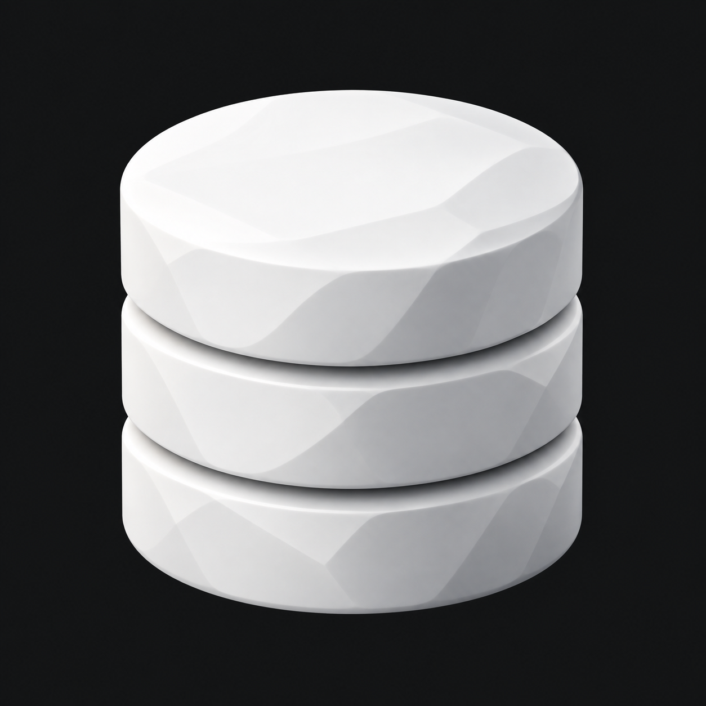

# Database Studio – Datenbank-Zylinder

Weiterentwicklung von Strata: drei runde, exakt übereinander angeordnete Zylindersegmente mit elliptischer Deckfläche und zwei klaren Trennfugen. Weiße, weich facettierte Materialwirkung wie beim Cortex-Icon.



Erstellt mit dem integrierten Imagegen-Werkzeug. Referenzen: `01-Strata.png` als Ausgangsmotiv und `references/Cortex.png` ausschließlich als Material- und Lichtreferenz. Konzeptbild mit dunklem Hintergrund.

## Vollständiger Bildprompt

```text
Use case: logo-brand, precise-object-edit.
Create ONE refined new Database Studio logo concept by modifying Image 1 (the three stacked rounded-square slabs). Image 2 (Cortex's white faceted brain sculpture) is ONLY a reference for material, broad softly curved facets, lighting and sculpture quality. Do not depict a brain or use its silhouette.
The user specifically wants the symbol to read MUCH MORE IMMEDIATELY AS A DATABASE. Replace the square slabs with the familiar classic database cylinder: exactly THREE equal-diameter circular cylindrical tiers stacked vertically on precisely the same axis, no lateral shifts or twist. Two narrow deep horizontal curved separation grooves divide the tiers clearly. A broad ELLIPTICAL top face is strongly visible from a view slightly above. Curved elliptical bottom edges and repeated arcing tier boundaries create the unmistakable database-storage pictogram. Overall stacked cylinder is about as tall as it is wide, compact and substantial. Each tier has a meaningful vertical wall, not thin coins or pancakes. No holes or central spindle.
Style: a premium white 3D sculpture inspired by the supplied Cortex reference. Matte white porcelain / carved white mineral; softly beveled circular rims, smooth clean cylindrical contour, broad subtle sculpted facets across the white top and side surfaces, gently shifting pearl and pale-gray highlights. Keep the basic round cylinder unmistakable; faceting must never make it squarish. Soft controlled shadows in the two grooves, illumination upper left, dimensional but restrained. Carefully sculpted minimalist app-logo finish; memorable simple silhouette readable at small sizes.
Composition: ONE object centered on a completely uniform opaque dark charcoal background #141516 in a square 1024x1024 image. The object fills 68% of image width and 70% of height, equal breathing room. Slightly elevated frontal orthographic view. No floor or horizon. The background MUST remain an opaque dark charcoal image field, no transparency, no cutout processing. Smooth immaculate anti-aliased contours; remove all stray white flecks and fringing from the original reference image.
No typography or captions, no rounded-square app tile, no network nodes, no brain, no circuits, no cloud, no server racks, no colored lights, no metallic chrome, no glass. Deliver only this single circular three-tier database sculpture.
```

