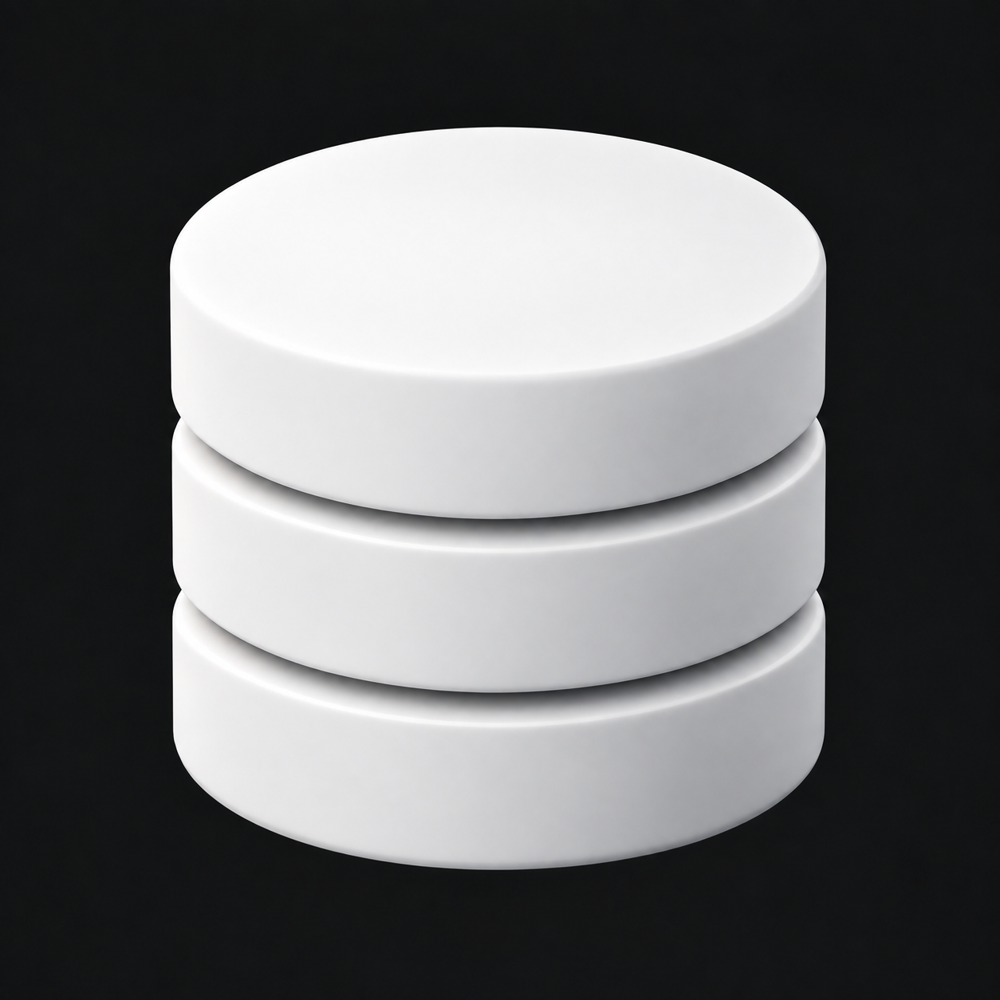

# Database Studio – glatte Oberfläche

Drei runde Datenbank-Schichten mit glatter, seidenmatter weißer Oberfläche. Die kristallinen Facetten wurden entfernt; Form, Perspektive und Trennfugen bleiben erhalten.



Mit dem integrierten Imagegen-Werkzeug aus `05-Datenbank-Zylinder.png` erstellt.

## Vollständiger Bildprompt

```text
Use case: precise-object-edit.
Edit the supplied Database Studio logo image with ONE targeted change: remove the entire faceted, low-poly, crystal-like / carved-mineral surface treatment and replace it with perfectly smooth satin-matte white surfaces.
Preserve exactly the existing three-tier circular database cylinder, equal diameters, height and proportions, two recessed curved horizontal separation grooves, elliptical top face, softly rounded rims, perspective, composition, object size and position, lighting direction and dark charcoal background.
The three cylinder walls must be smooth continuously curved surfaces with uninterrupted soft shading. The top disk must be a smooth flat plane with subtle continuous studio illumination. No polygon edges, no triangular patches, no facets, no angular tonal boundaries, no crystalline cuts, no stone texture, no mineral texture, no marbling anywhere. Aim for pristine satin-white molded ceramic: restrained soft highlights, smooth gradients, clean precise silhouette, subtle bevels, no glossy wet reflections.
Keep the three tiers and the two shadow gaps distinctly readable. Keep all geometry and camera angle of the reference unchanged. The result should feel calm, refined, minimal and unmistakably like a database.
Single image, same square composition, opaque charcoal background. No transparency, no cutout fringe, no text, no labels, no additional shapes, no app tile, no colored accents. This is a surface-finish correction of the supplied logo, not a new symbol.
```

