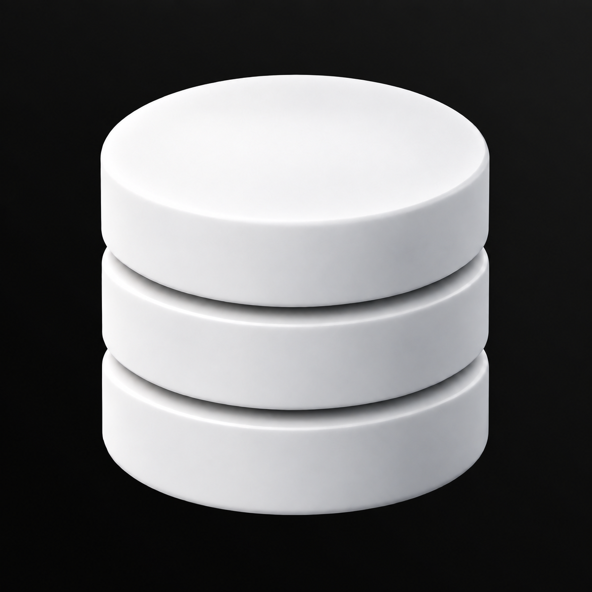

# Database Studio – gleichmäßiger Schimmer von oben rechts

Sehr dezenter, neutralgrauer Helligkeitsverlauf diagonal aus der oberen rechten Ecke. Die Hintergrundgestaltung wurde vereinheitlicht; Form und Beleuchtung des Datenbankmotivs sollten erhalten bleiben.



Mit dem integrierten Imagegen-Werkzeug aus `07-Datenbank-Lichtschimmer.png` erstellt.

## Vollständiger Bildprompt

```text
Use case: precise-object-edit.
Edit ONLY the dark background of the supplied Database Studio logo image. Two exact corrections requested by the user: (1) the exceedingly subtle brightness fade must come DIAGONALLY FROM THE TOP-RIGHT CORNER, (2) it must be much more UNIFORM, with a single pure neutral gray tone instead of uneven patches, multiple hues or tonal ripples.
Keep the white three-tier database cylinder exactly as in the reference: same geometry, position, scale, camera angle, smooth satin surfaces, two recessed grooves, existing object lighting, highlights, shadows and clean silhouette. Do not relight the sculpture.
Replace the background illumination with ONE immaculate continuous near-black diagonal gradient. The brightest background point lies at the extreme TOP-RIGHT corner and the light smoothly fades diagonally toward the BOTTOM-LEFT. Imagine an infinitely broad diffused source a kilometer beyond the upper-right corner, not an actual light in the frame. Pure achromatic grayscale throughout: equal red, green and blue values at every background pixel. Peak brightness approximately RGB 23,23,23 at the top-right corner; minimum approximately RGB 14,14,14 toward the bottom-left. Only nine 8-bit brightness levels of total variation. Keep it barely perceptible and visually almost black. One simple smooth broad linear diagonal falloff, softly eased, monotonic, without local bumps or irregularities.
CRITICAL: remove ALL existing background texture, mottling, waves, cloudy patterns, colored tints, gradients within gradients, radial halos, warm/cool shifts, grain and vignettes. No multiple tones other than the one continuous neutral brightness ramp. No visible beam or cone, no spotlight, no rays, no haze, no smoke, no light spot, no brighter outline on the object, no floor, no horizon, no extra shapes. The background should look like a perfectly clean digitally controlled grayscale fill with an extraordinarily subtle diagonal brightness fade.
Same square composition, fully opaque background, no transparency, no labels or text. Only the requested background corrections.
```

