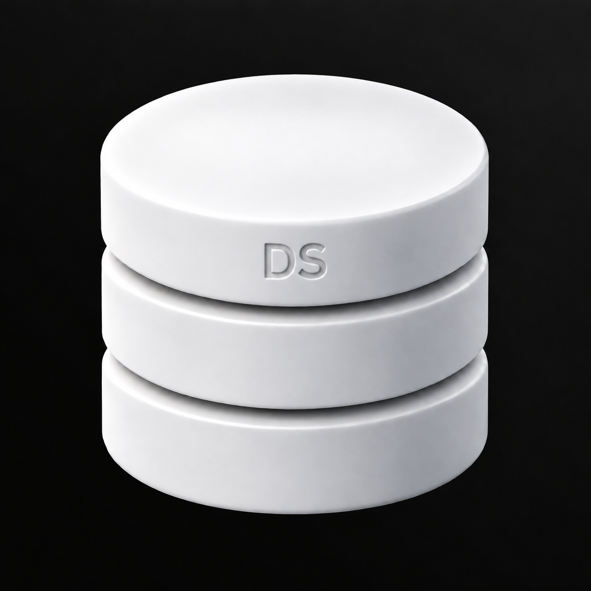

# Monogramm

Eine kleine DS-Gravur gibt dem Zeichen eine eigene Identität.



Grundlage: `../08-Datenbank-Schimmer-Oben-Rechts.png`. Erstellt mit dem integrierten Imagegen-Werkzeug.

## Vollständiger Bildprompt

```text
Use case: precise-object-edit, logo-brand.
Create ONE detail variation of the supplied Database Studio logo. The only change is the single detail specified below.
Preserve the reference's exact three smooth satin-white cylindrical database tiers, equal diameters, proportions, silhouette, camera angle, object placement, scale, two curved horizontal gaps, top ellipse, bevels and studio shading. Preserve the immaculate near-black background with the barely perceptible UNIFORM neutral-gray diagonal fade from the TOP-RIGHT corner. No colored tint, no texture or patchiness in the background. Same square framing.
Keep all surfaces perfectly smooth: no facets, no crystalline or low-poly look, no stone, no marbling. Restrained premium industrial design, tactile matte-white ceramic with subtle shadows. The detail must be readable but quiet. It must look integrated into the object, not pasted on. No additional decorations, labels, border or rounded app tile. No extra objects, no environment. Fully opaque near-black background and clean contours.
Single detail: add a small precise debossed monogram reading exactly "DS" centered on the FRONT FACE OF THE UPPER CYLINDRICAL TIER. Simple geometric sans-serif capitals, regular-medium weight, letter spacing slightly open, total width approximately 14 percent of cylinder diameter, height 7 percent of total object height. The letters are recessed very shallowly into the white surface, white-on-white with a soft light-gray inner shadow and subtle beveled edges, clearly readable but discreet. No black ink, no metallic fill, no other letters or logos, no additional details. The top ellipse stays blank.
```

