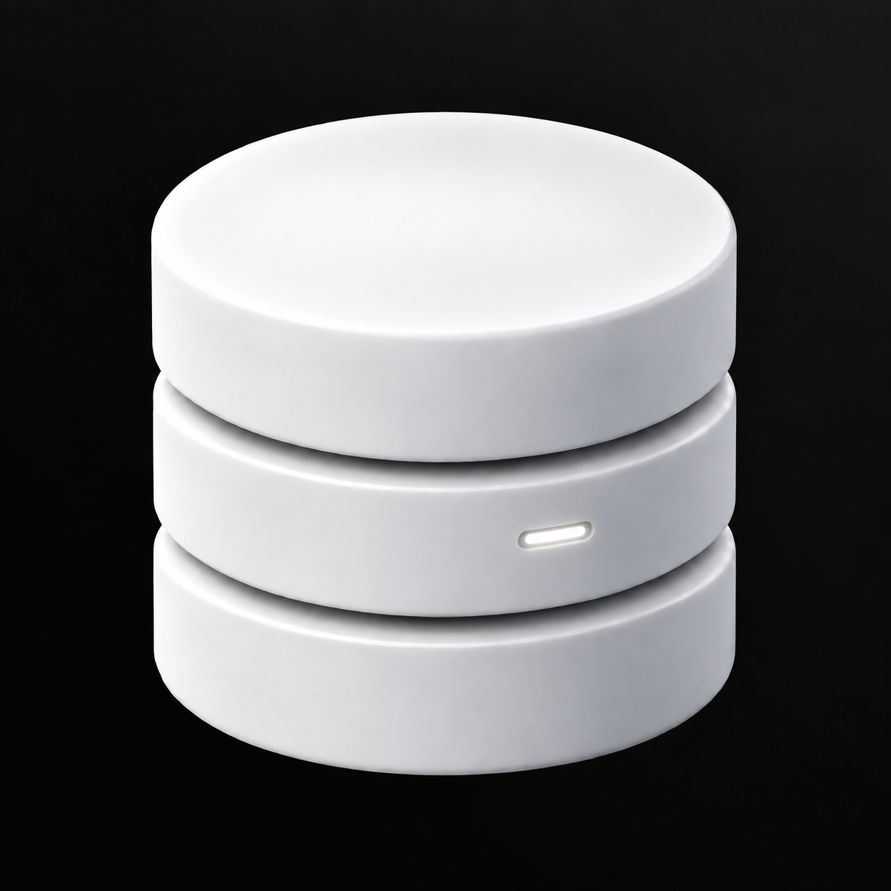

# Statuslicht

Ein winziger weißer Lichtschlitz lässt die Datenbank aktiv wirken.



Grundlage: `../08-Datenbank-Schimmer-Oben-Rechts.png`. Erstellt mit dem integrierten Imagegen-Werkzeug.

## Vollständiger Bildprompt

```text
Use case: precise-object-edit, logo-brand.
Create ONE detail variation of the supplied Database Studio logo. The only change is the single detail specified below.
Preserve the reference's exact three smooth satin-white cylindrical database tiers, equal diameters, proportions, silhouette, camera angle, object placement, scale, two curved horizontal gaps, top ellipse, bevels and studio shading. Preserve the immaculate near-black background with the barely perceptible UNIFORM neutral-gray diagonal fade from the TOP-RIGHT corner. No colored tint, no texture or patchiness in the background. Same square framing.
Keep all surfaces perfectly smooth: no facets, no crystalline or low-poly look, no stone, no marbling. Restrained premium industrial design, tactile matte-white ceramic with subtle shadows. The detail must be readable but quiet. It must look integrated into the object, not pasted on. No additional decorations, labels, border or rounded app tile. No extra objects, no environment. Fully opaque near-black background and clean contours.
Single detail: add ONE tiny horizontal status-light slit on the front-right portion of the MIDDLE CYLINDRICAL TIER. A pill-shaped precision inset about 7 percent of the cylinder diameter wide and 0.9 percent of total object height tall, placed about two-thirds across the front-facing area. Soft pearl-white illumination in a very shallow narrow neutral-gray recess, restrained brightness, legible but not a glowing neon mark. A minute natural surrounding light reflection may exist on the ceramic only. No cyan, blue, green or colored light; strictly neutral white. No halo on the background, no multiple lights, no dot rows, no other marks or additions. The top ellipse stays blank.
```

