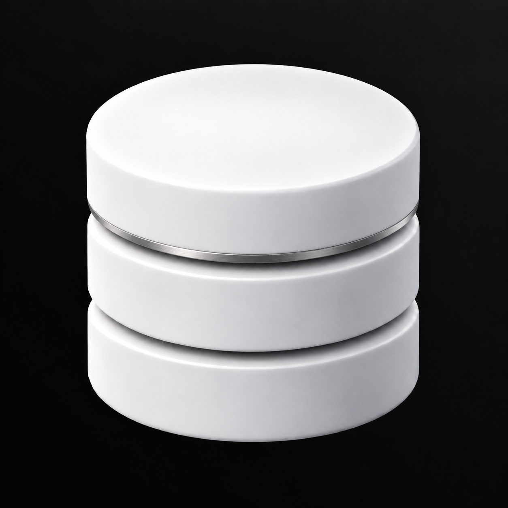

# Metallring

Ein feiner satinierter Silberring setzt einen Materialkontrast.



Grundlage: `../08-Datenbank-Schimmer-Oben-Rechts.png`. Erstellt mit dem integrierten Imagegen-Werkzeug.

## Vollständiger Bildprompt

```text
Use case: precise-object-edit, logo-brand.
Create ONE detail variation of the supplied Database Studio logo. The only change is the single detail specified below.
Preserve the reference's exact three smooth satin-white cylindrical database tiers, equal diameters, proportions, silhouette, camera angle, object placement, scale, two curved horizontal gaps, top ellipse, bevels and studio shading. Preserve the immaculate near-black background with the barely perceptible UNIFORM neutral-gray diagonal fade from the TOP-RIGHT corner. No colored tint, no texture or patchiness in the background. Same square framing.
Keep all surfaces perfectly smooth: no facets, no crystalline or low-poly look, no stone, no marbling. Restrained premium industrial design, tactile matte-white ceramic with subtle shadows. The detail must be readable but quiet. It must look integrated into the object, not pasted on. No additional decorations, labels, border or rounded app tile. No extra objects, no environment. Fully opaque near-black background and clean contours.
Single detail: introduce ONE very thin satin-brushed silver/titanium ring as a precision inlay running around the cylinder at the LOWER RIM OF THE UPPER TIER, just above the first dark separation groove. It follows the cylindrical contour in correct perspective, subtly elliptical. Width approximately 1.2 percent of total object height: visibly a thin metal band, not a thick fourth layer. Neutral silver with a restrained soft specular highlight and darker graphite reflections, finely finished, no mirror chrome, no gold, no color. Preserve both existing tier gaps and all white ceramic surfaces. This one ring is the entire addition; no engraving, buttons or status lights. Top ellipse remains blank.
```

