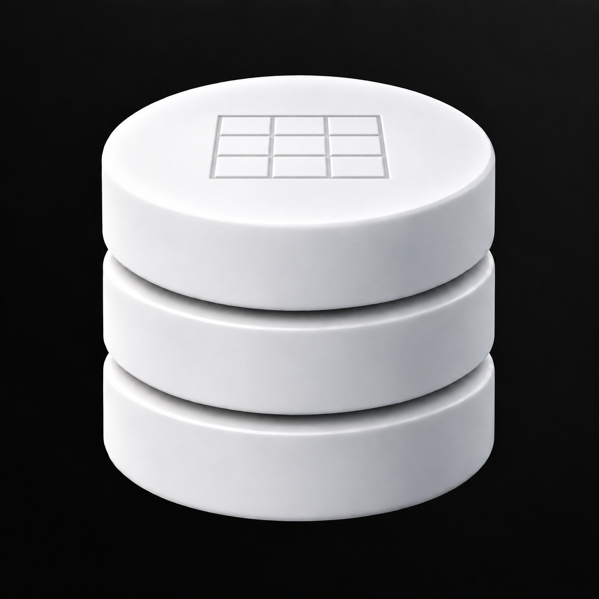

# Tabellenraster

Ein flach eingraviertes Raster auf der Oberseite verweist auf Datentabellen.



Grundlage: `../08-Datenbank-Schimmer-Oben-Rechts.png`. Erstellt mit dem integrierten Imagegen-Werkzeug.

## Vollständiger Bildprompt

```text
Use case: precise-object-edit, logo-brand.
Create ONE detail variation of the supplied Database Studio logo. The only change is the single detail specified below.
Preserve the reference's exact three smooth satin-white cylindrical database tiers, equal diameters, proportions, silhouette, camera angle, object placement, scale, two curved horizontal gaps, top ellipse, bevels and studio shading. Preserve the immaculate near-black background with the barely perceptible UNIFORM neutral-gray diagonal fade from the TOP-RIGHT corner. No colored tint, no texture or patchiness in the background. Same square framing.
Keep all surfaces perfectly smooth: no facets, no crystalline or low-poly look, no stone, no marbling. Restrained premium industrial design, tactile matte-white ceramic with subtle shadows. The detail must be readable but quiet. It must look integrated into the object, not pasted on. No additional decorations, labels, border or rounded app tile. No extra objects, no environment. Fully opaque near-black background and clean contours.
Single detail: add a small shallow engraved TABLE GRID at the center of the TOP ELLIPTICAL SURFACE only. A precise rectangular grid of three columns and three rows, projected correctly onto the horizontal top face and thus seen in the same foreshortened perspective. The entire grid spans about 34 percent of the cylinder diameter. Lines are narrow, delicately recessed, in soft gray shadows, white ceramic inside all cells, no printed black ink. A single outer rectangular border and two internal lines each way create exactly nine cells. This is a subtle table/database schema engraving, NOT raised keys or separate blocks. No characters, numbers, icons, circuit branches or other decoration. Front faces stay completely blank.
```

