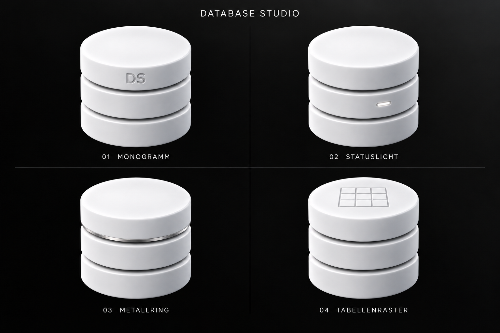

# Database Studio – vier Detailvarianten

Vier Verfeinerungen der glatten Datenbankform, jeweils mit einem eigenen Detail.

- [Monogramm](01-Monogramm.md): Eine kleine DS-Gravur gibt dem Zeichen eine eigene Identität.
- [Statuslicht](02-Statuslicht.md): Ein winziger weißer Lichtschlitz lässt die Datenbank aktiv wirken.
- [Metallring](03-Metallring.md): Ein feiner satinierter Silberring setzt einen Materialkontrast.
- [Tabellenraster](04-Tabellenraster.md): Ein flach eingraviertes Raster auf der Oberseite verweist auf Datentabellen.

Die Einzelbilder und vollständigen Prompts sind über die jeweiligen Varianten verlinkt. Alle Bilder wurden mit dem integrierten Imagegen-Werkzeug erstellt.

