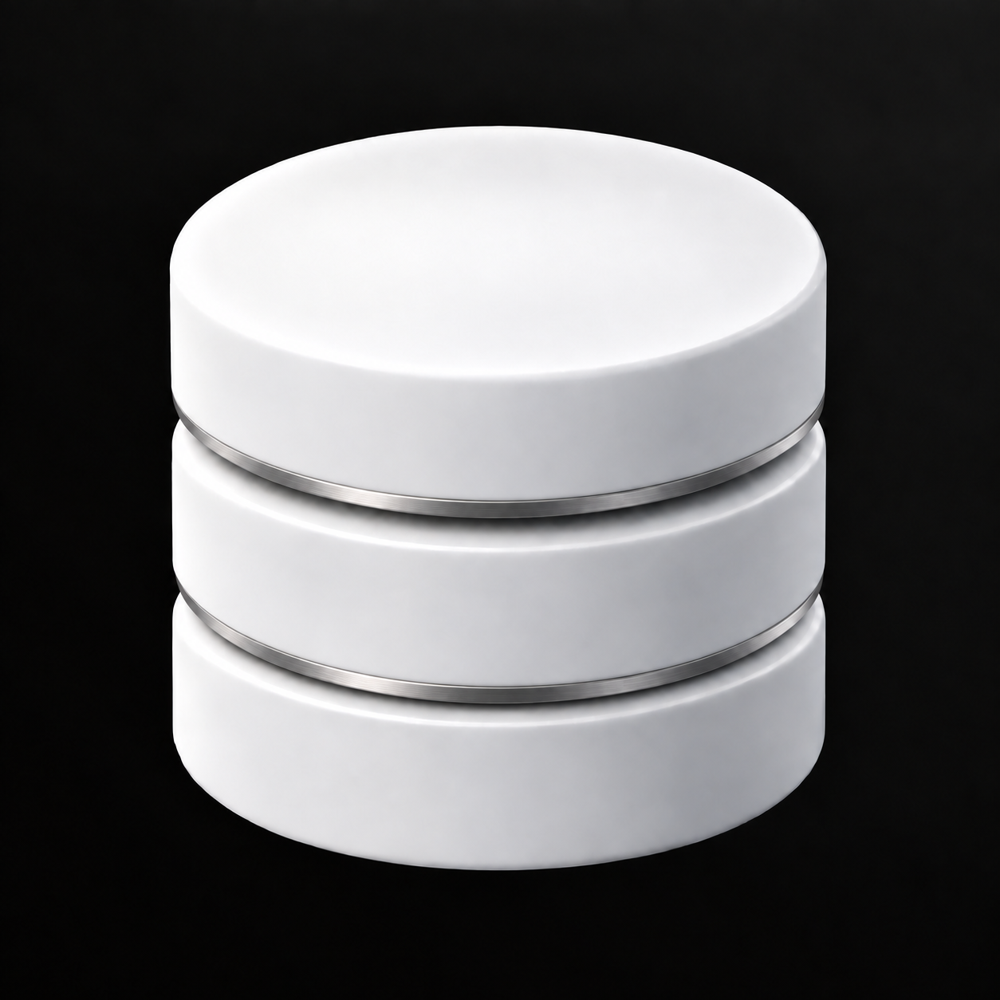

# Database Studio – zwei Metallringe

Variante 03 mit zwei passenden, schmalen Silberringen: jeweils einer an der unteren Kante der oberen und mittleren Datenbank-Schicht.



Mit dem integrierten Imagegen-Werkzeug aus `09-Detailvarianten/03-Metallring.png` erstellt.

## Vollständiger Bildprompt

```text
Use case: precise-object-edit.
Make exactly ONE change to the supplied Database Studio logo: add a SECOND thin satin-brushed silver metal ring matching the existing ring.
The existing ring follows the lower rim of the TOP white cylinder, just above the first dark horizontal separation groove. Keep it unchanged. Add an identical matching ring following the lower rim of the MIDDLE white cylinder, just above the second dark horizontal separation groove. The result must contain exactly TWO silver rings, one at each of the two tier boundaries. Match their visible width, neutral silver/titanium material, fine horizontal brushing, soft specular highlights, finish, cylindrical curvature and perspective. Make the new ring equally thin and precisely integrated. No ring along the bottom base and no ring around the top ellipse.
Preserve everything else exactly: all three smooth satin-white cylinder tiers, silhouette, proportions, spacing, two grooves, smooth blank top ellipse, soft bevels, original camera angle, placement, framing, original object lighting and shadows. Preserve the opaque near-black background with its nearly imperceptible uniform neutral-gray fade diagonally from the top-right corner.
No facets, no stone texture, no low-poly surfaces, no lettering, no status lights, no table grid, no additional details. No new colors or background effects. One clean square logo image, with only the requested matching second ring added.
```

