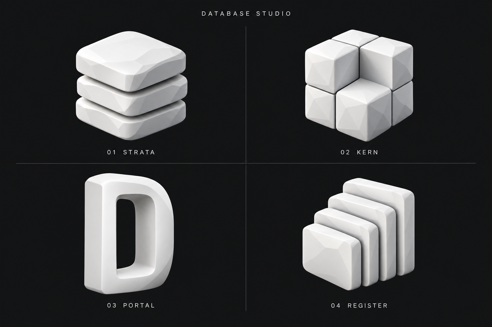

# Database Studio – Logoentwürfe

Vier alternative Motive, inspiriert vom lokal installierten Cortex-Icon.

Weiterentwicklung auf Wunsch: [05 Datenbank-Zylinder](05-Datenbank-Zylinder.md) – drei runde Schichten in der klassischen Datenbankform.

Aktuelle Verfeinerung: [06 Datenbank Glatt](06-Datenbank-Glatt.md) – gleiche Form mit glatter, seidenmatter Oberfläche ohne kristalline Facetten.

Weitere Verfeinerung: [07 Datenbank Lichtschimmer](07-Datenbank-Lichtschimmer.md) – kaum sichtbarer Helligkeitsverlauf von oben im schwarzen Hintergrund.

Neueste Variante: [08 Schimmer oben rechts](08-Datenbank-Schimmer-Oben-Rechts.md) – gleichmäßiger neutralgrauer Verlauf diagonal aus der oberen rechten Ecke.

Vier mögliche Details: [Monogramm, Statuslicht, Metallring und Tabellenraster](09-Detailvarianten/README.md).

Weiterentwicklung von Detail 03: [10 Datenbank mit zwei Metallringen](10-Datenbank-Zwei-Metallringe.md).

## Gestalterische Referenz

Quelle: `/Applications/Cortex.app/Contents/Resources/Code.icns`, am 12. September 2026 als PNG nach `references/Cortex.png` exportiert.

Übernommen werden die freistehende weiße Skulptur, breite weiche Facetten, dezente graue Schatten und eine markante Silhouette. Das Gehirn-Motiv und das bisherige Netzwerksymbol von Database Studio sind ausgeschlossen.

## Richtungen

| Entwurf | Motiv | Gedanke |
| --- | --- | --- |
| [01 Strata](01-Strata.png) | Drei plastische, quadratische Schichten | Daten sammeln und ordnen |
| [02 Kern](02-Kern.png) | Modularer Würfel mit offener Ecke | Struktur und Einblick in Daten |
| [03 Portal](03-Portal.png) | Massiver Rahmen mit tiefer Öffnung | Zugang zu Daten; abstrahierte D-Anmutung |
| [04 Register](04-Register.png) | Vier versetzte, aufrechte Platten | Datensätze sammeln und wiederfinden |

Mein Favorit ist **Strata**: Die Schichten vermitteln Daten und Ordnung. Die kompakte Silhouette und das plastische Material passen gut zu Cortex. **Kern** ist die Alternative, wenn Modularität und ein architektonischer Ausdruck wichtiger sind.

Die Bilder sind Konzeptstudien. Die Einzelbilder sind ursprüngliche Generierungsergebnisse; die Übersicht enthält eine zusätzliche Bereinigung der Freistellungsränder. Eine ausgewählte Richtung kann anschließend als finales App-Icon mit sauberer Transparenz und passenden Größen ausgearbeitet werden.

Generiert mit dem integrierten Imagegen-Werkzeug. Vollständige Prompts: [PROMPTS.md](PROMPTS.md) und [VERGLEICH-PROMPT.md](VERGLEICH-PROMPT.md).
